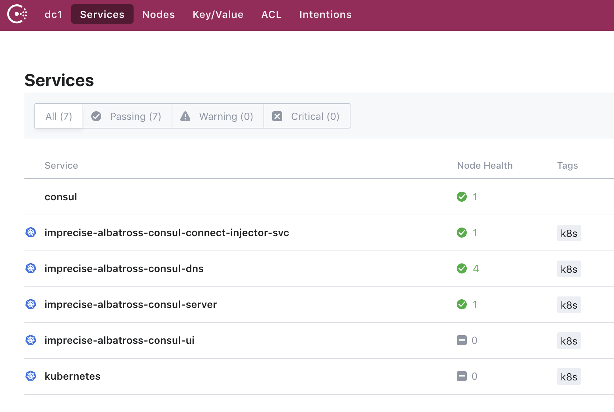
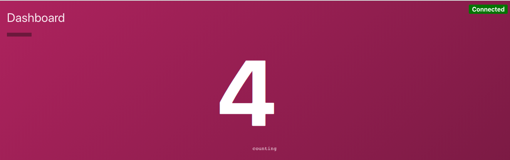
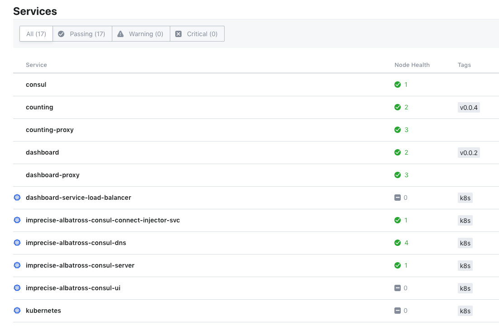
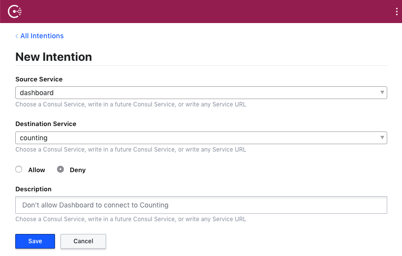
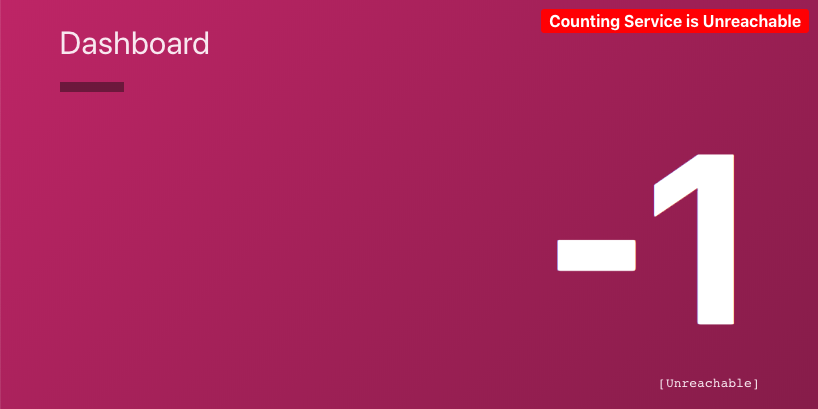
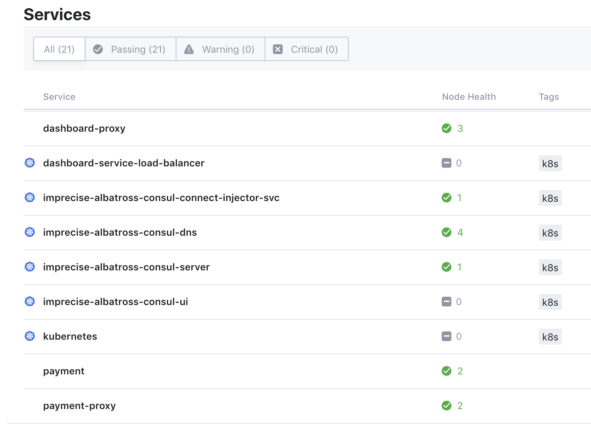
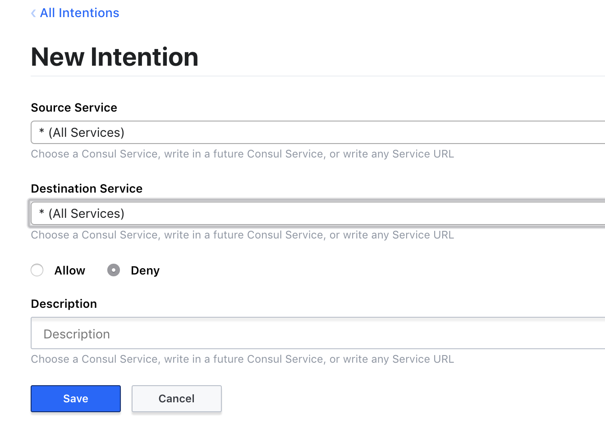

# Introduction to Consul Connect with Kubernetes

In this guide I'll walk you through how to use Kubernetes in GCP with HashiCorp Consul as a service discovery and service mesh tool, both inside and outside of the Kubernetes cluster. We'll install Consul with just a few commands, then deploy some custom services that will then use Consul to discover each other over encrypted TLS via Consul Connect. We'll then do the same thing for services outside of Kubernetes. Finally, we'll leverage intentions in Consul to tighten down the whole thing.

* [Task 1: Prerequisites and Setup](#Task1)
* [Task 2: Install Helm to the Kubernetes cluster](#Task2)
* [Task 3: Enable Stub DNS](#Task3)
* [Task 4: Create an application that uses Consul Connect secure service segmentation](#Task4)
* [Task 5: Service mesh outside Kubernetes](#Task5)
* [Task 6: Leverage Consul Intentions to deny service communication](#Task6)


## <a name="Task1"></a> Task 1: Prerequisites and Setup
Before we get started, I have already setup `gcloud` command line tool, `helm` and `kubectl`:

https://cloud.google.com/sdk/docs/downloads-interactive

    gcloud init

Install helm and kubectl with Homebrew.

    brew install kubernetes-cli
    brew install kubernetes-helm

### Service account authentication
It's recommended that you create a GCP IAM service account and authenticate with it on the command line.

https://console.cloud.google.com/iam-admin/serviceaccounts

https://cloud.google.com/sdk/gcloud/reference/auth/activate-service-account

    gcloud auth activate-service-account --key-file="my-consul-service-account.json"

### Ensure Google APIs are enabled
For your account you need to ensure the APIs are enabled. If you are starting from scratch they are most likely not, so you'll need to enable them.:

https://cloud.google.com/endpoints/docs/openapi/enable-api

Enable:
```
compute.googleapis.com            Compute Engine API
container.googleapis.com          Kubernetes Engine API
```

### Create a kubernetes cluster
Assuming your previous steps are setup correct, then you should be able to create a standard-cluster via the CLI. We'll call the cluster `consul-cluster` and deploy it to the `australia-southeast1-a` zone.

```sh
gcloud container clusters create consul-cluster \
      --zone australia-southeast1-a

```

### Configure kubectl to talk to your cluster

```sh
gcloud container clusters get-credentials consul-cluster \
      --zone australia-southeast1-a
```

## <a name="Task2"></a>Task 2: Install Helm to your cluster
Once we have our foundation laid, we can commence the rollout of Consul. The easiest way to deploy Consul to Kubernetes is using helm. First, lets initialise helm:

    helm init

You can verify that the `tiller-deploy` service is running with:

```sh
kubectl get pods --namespace kube-system
```

You should see several services with `tiller-deploy-*` somewhere near the bottom.

Next, create permissions for the service account so it can install Helm charts (packages).
```sh
kubectl create clusterrolebinding add-on-cluster-admin --clusterrole=cluster-admin --serviceaccount=kube-system:default
```
You should see output:
```
clusterrolebinding.rbac.authorization.Kubernetes.io "add-on-cluster-admin" created
```
Create a new file named `helm-consul-values.yaml`. Edit with the following code. Comments inline about what we are doing:

```yaml
global:
  datacenter: dc1
  image: "consul:latest"

# Expose the Consul UI through this LoadBalancer
ui:
  service:
    type: "LoadBalancer"

# Allow Consul to inject the Connect proxy into Kubernetes containers
connectInject:
  enabled: true

# Configure a Consul client on Kubernetes nodes. GRPC listener is required for Connect.
client:
  enabled: true
  grpc: true

# Minimal Consul configuration. Not suitable for production.
server:
  replicas: 1
  bootstrapExpect: 1
  disruptionBudget:
    enabled: true
    maxUnavailable: 0

# Sync Kubernetes and Consul services
syncCatalog:
  enabled: true
```

Install Consul to the cluster. We'll use a clone of the official HashiCorp Consul on Kubernetes GitHub repo and then install it using our values defined previously.

    git clone https://github.com/hashicorp/consul-helm.git

    helm install -f helm-consul-values.yaml ./consul-helm


*Note: If you don't give the cluster a name with `--name` then the Helm chart will randomly generate one for you.*


This step can take a few minutes.

A large amount of text will output to the screen, something like:

```
NAME:   imprecise-albatross
LAST DEPLOYED: Wed Dec 19 12:35:22 2018
NAMESPACE: default
STATUS: DEPLOYED

RESOURCES:
==> v1/ConfigMap
NAME                                      AGE
imprecise-albatross-consul-client-config  1s
imprecise-albatross-consul-server-config  1s

==> v1beta1/PodDisruptionBudget
imprecise-albatross-consul-server  0s

==> v1/Pod(related)

NAME                                                             READY  STATUS             RESTARTS  AGE
imprecise-albatross-consul-bsgbn                                 0/1    ContainerCreating  0         0s
imprecise-albatross-consul-gpwn4                                 0/1    ContainerCreating  0         0s
imprecise-albatross-consul-hwbjx                                 0/1    ContainerCreating  0         0s
imprecise-albatross-consul-connect-injector-webhook-deployw9gt4  0/1    ContainerCreating  0         0s
imprecise-albatross-consul-sync-catalog-569746b955-grlbt         0/1    ContainerCreating  0         0s
imprecise-albatross-consul-server-0                              0/1    Pending            0         0s

==> v1/Deployment

NAME                                                            AGE
imprecise-albatross-consul-connect-injector-webhook-deployment  0s
imprecise-albatross-consul-sync-catalog                         0s

==> v1/ServiceAccount
imprecise-albatross-consul-connect-injector-webhook-svc-account  1s
imprecise-albatross-consul-sync-catalog                          1s

==> v1beta1/ClusterRole
imprecise-albatross-consul-connect-injector-webhook  1s

==> v1/ClusterRole
imprecise-albatross-consul-sync-catalog  1s

==> v1beta1/ClusterRoleBinding
imprecise-albatross-consul-connect-injector-webhook-admin-role-binding  1s

==> v1/ClusterRoleBinding
imprecise-albatross-consul-sync-catalog  1s

==> v1/Service
imprecise-albatross-consul-connect-injector-svc  1s
imprecise-albatross-consul-dns                   1s
imprecise-albatross-consul-server                0s
imprecise-albatross-consul-ui                    0s

==> v1/DaemonSet
imprecise-albatross-consul  0s

==> v1/StatefulSet
imprecise-albatross-consul-server  0s

==> v1beta1/MutatingWebhookConfiguration
imprecise-albatross-consul-connect-injector-cfg  0s
```
Several key values to note here:
* Service Name: `imprecise-albatross` is unique to each install. We'll reference this later so keep that in mind
* `==> v1/Service:` We'll explicitly look at these in more detail, but good to know what has been deployed
  * imprecise-albatross-consul-connect-injector-svc
  * imprecise-albatross-consul-dns
  * imprecise-albatross-consul-server
  * imprecise-albatross-consul-ui

Wait another moment, and then  verify that all services are up:

```sh
kubectl get pods
```

```
NAME                                                              READY   STATUS    RESTARTS   AGE
imprecise-albatross-consul-bsgbn                                  1/1     Running   0          3m
imprecise-albatross-consul-connect-injector-webhook-deployw9gt4   1/1     Running   0          3m
imprecise-albatross-consul-gpwn4                                  1/1     Running   0          3m
imprecise-albatross-consul-hwbjx                                  1/1     Running   0          3m
imprecise-albatross-consul-server-0                               1/1     Running   0          3m
imprecise-albatross-consul-sync-catalog-569746b955-grlbt          1/1     Running   0          3m
```

We can also verify that the services defined earlier for `imprecise-albatross` are running with:

```sh
kubectl get svc
```

We can then verify that Consul is up and running by visiting the exposed LoadBalancer IP address:

```sh
get svc imprecise-albatross-consul-ui
```
```
NAME                            TYPE           CLUSTER-IP      EXTERNAL-IP     PORT(S)        AGE
imprecise-albatross-consul-ui   LoadBalancer   10.47.255.168   35.189.28.251   80:32085/TCP   28m
```

You should see consul is running and has imported all our services:




## <a name="Task3"></a>Task 3: Enable Stub DNS
In order for Consul service discovery to work smoothly, we need to enable Consul within the [Kubernetes DNS system](https://www.consul.io/docs/platform/Kubernetes/dns.html).

Find the name of your DNS service with

```sh
kubectl get svc
```

It should look something like `imprecise-albatross-consul-dns`

We'll then create a quick script in bin called `enable-consul-stub-dns.sh`

    mkdir bin
    vi bin/enable-consul-stub-dns.sh

The contents of the script:
```sh
#!/usr/bin/env sh

# Loads a ConfigMap that allows pods to use the `.consul` TLD.
# Call with the name of your DNS service as deployed by the Consul Helm chart.
#
#     bin/enable-consul-stub-dns.sh piquant-shark-consul-dns
#
# https://www.consul.io/docs/platform/Kubernetes/dns.html

DNS_SERVICE_NAME=$1

cat <<EOF | kubectl apply -f -
apiVersion: v1
kind: ConfigMap
metadata:
  labels:
    addonmanager.kubernetes.io/mode: EnsureExists
  name: kube-dns
  namespace: kube-system
data:
  stubDomains: |
    {"consul": ["$(kubectl get svc $DNS_SERVICE_NAME -o jsonpath='{.spec.clusterIP}')"]}
EOF
```

Update the permissions of the script

    chmod +x bin/enable-consul-stub-dns.sh

Pass the service name matching `*-consul-dns` to the stub DNS script just created (with your cluster name)


```
bin/enable-consul-stub-dns.sh imprecise-albatross-consul-dns
```

You'll then see something like this:
```
Warning: kubectl apply should be used on resource created by either kubectl create --save-config or kubectl apply
configmap/kube-dns configured
```

## <a name="Task4"></a>Task 4: Create an application that uses Consul Connect secure service segmentation

In order to test Consul Connect in this new cluster, we need some services to run. To make this guide simpler we have preconfigured two simple services:

* Counting Service: Will start an incremental counter
* Dashboard Service: Will connect to the Counting Service, retrieve the current count and display this via a simple web page.

Lets first define both these services as code, and place them in a separate directory:

    mkdir services && cd services

    vi counting-service.yaml

The code for the Counting Service:

```yaml
apiVersion: v1
kind: Pod
metadata:
  name: counting
  annotations:
    "consul.hashicorp.com/connect-inject": "true"
spec:
  containers:
  - name: counting
    image: hashicorp/counting-service:0.0.2
    ports:
    - containerPort: 9001
      name: http
  initContainers:
  - name: counting-init
    image: hashicorp/counting-init:0.0.9
    env:
    - name: POD_IP
      valueFrom:
        fieldRef:
          fieldPath: status.podIP
    - name: HOST_IP
      valueFrom:
        fieldRef:
          fieldPath: status.hostIP
```


```sh
vi dashboard-service.yaml
```
The code for the dashboard service:

```yaml
apiVersion: v1
kind: Pod
metadata:
  name: dashboard
  labels:
    app: "dashboard"
  annotations:
    "consul.hashicorp.com/connect-inject": "true"
    "consul.hashicorp.com/connect-service-upstreams": "counting:9001"
spec:
  containers:
  - name: dashboard
    image: hashicorp/dashboard-service:0.0.3
    ports:
    - containerPort: 9002
      name: http
    env:
    - name: COUNTING_SERVICE_URL
      value: "http://localhost:9001"
  initContainers:
  - name: dashboard-init
    image: hashicorp/dashboard-init:0.0.4
    env:
    - name: POD_IP
      valueFrom:
        fieldRef:
          fieldPath: status.podIP
    - name: HOST_IP
      valueFrom:
        fieldRef:
          fieldPath: status.hostIP
---
apiVersion: "v1"
kind: "Service"
metadata:
  name: "dashboard-service-load-balancer"
  namespace: "default"
  labels:
    app: "dashboard"
spec:
  ports:
  - protocol: "TCP"
    port: 80
    targetPort: 9002
  selector:
    app: "dashboard"
  type: "LoadBalancer"
  loadBalancerIP: ""
```
The configuration you created uses several Consul commands to setup proxies between services.

The counting service needs to start an extra container running consul that manually starts its own proxy.

You'll also notice the dashboard service needs to start an extra container running consul that manually starts an upstream proxy to the counting service proxy.

Lets apply both of these services to get them running in our Kubernetes cluster:

    kubectl create -f services/

We can now view the LoadBalancer of the Dashboard service to see the two in action. Lookup the loadblancer service and collect he external IP

```
kubectl get svc dashboard-service-load-balancer
```
You should see something like:

```
NAME                              TYPE           CLUSTER-IP     EXTERNAL-IP     PORT(S)        AGE
dashboard-service-load-balancer   LoadBalancer   10.47.242.43   35.197.183.60   80:31657/TCP   1m
```
Open the external IP in a browser. Observe in the top right hand corner the service is `connected` and counting is incrementing.



If you take another look at the Consul UI - you'll notice that we have several new services representing the counting and dashboard services. If you drill into these further you'll be able to see the IPs representing the service and the nodes they are running on.



We can then create some intentions to test the service. In the Consul UI, select *Intentions*. Create a new Intention:



You'll see a `Success` message. Now, visit the Dashboard service URL again. You should see the service has stopped and that counting is `unreachable`



You can have a further inspection of these services in the container, within Consul GUI. Some things to note:
* The services can come up at any IP address and using service discovery in consul will find each other.
* The services are communicating over mutual TLS via side car proxies injected by Consul through Kubernetes.

## <a name="Task5"></a>Task 5: Service Mesh outside of Kubernetes

Right now, you should have witnessed the power of consul for service discovery and service mesh *within* Kubernetes. However, one of the other great features of Consul is that it has been operating as service discovery and service mesh outside of Kubernetes for some time now.

To test this out, we'll now create a new service running on a standard VM.

### Step 1: Create a virtual machine
From the CLI again we can create a simple instance:

```sh
gcloud compute instances create payment-service \
    --zone=australia-southeast1-b \
    --machine-type=n1-standard-1 \
    --image=ubuntu-1604-xenial-v20181004 \
    --image-project=ubuntu-os-cloud
```
You should see the payment instance created.

### Step 2: Deploy your application (or mine)
Once the machine is up, connect to it via SSH and provision the server. The easiest way to do this for this guide is to borrow someone else's code. In this case I will use a colleague's payment gateway as the test service. You can find it [here](https://github.com/emojify-app/stack/blob/master/azure-kubernetes/packer/scripts/provision_payment.sh)

This script will completely provision the instance with Consul, the payment service and Consul Connect integration.

```sh
gcloud compute ssh --zone australia-southeast1-b "payment-service"
```
Once connected to the `payment-service` host:

```sh
curl -L https://raw.githubusercontent.com/emojify-app/stack/master/azure-kubernetes/packer/scripts/provision_payment.sh >> provision-payment.sh
chmod +x provision-payment.sh
./provision-payment.sh
```

This will take several minutes to run.

After this completes, setup a directory for the next step:
```sh
sudo mkdir /home/ubuntu/.kube
sudo chmod 777 /home/ubuntu/.kube
```

### Step 3: Configure Consul for your cluster
Given that Consul is running as a service in Kubernetes and so are our other services, to allow this new service to connect we need to be able to authenticate to the Kubernetes API. To do this we need two things:

1. Updated kubeconfig file
2. Access permissions

To achieve the first step, download the kube config file locally
```sh
gcloud container clusters get-credentials consul-cluster --zone australia-southeast1-a
```
Where,

* `consul-cluster` is your Kubernetes cluster name (if you changed it earlier)

You should see `kubeconfig entry generated for consul-cluster.`

This will download the config file to `~/.kube/config`

Copy that file to the new server under `/home/ubuntu/.kube/config`

```sh
gcloud compute scp ~/.kube/config payment-service:/home/ubuntu/.kube/config
```

To get access permissions you can create a new service account in GCP, and then copy the resulting .json file to `/home/ubuntu/.kube/config` or you can use the service account you created for yourself as part of the prerequisites (used to connect to the cluster locally - but not recommended for anything other than testing) and copy it to the same directory. I'll do the second way:

```sh
gcloud compute scp ~/Documents/GCP/cameron-huysmans-b45674d4d0bc.json payment-service:/home/ubuntu/.kube/creds.json
```

Note: I have called the target file `creds.json`

Connect to the instance update the Consul startup service to match your files

```sh
gcloud compute ssh --zone australia-southeast1-b "payment-service"
```
Creds File:
```sh
sudo vi /etc/systemd/system/consul.service
```

Add the following line at the end: `Environment=GOOGLE_APPLICATION_CREDENTIALS=/home/ubuntu/.kube/creds.json`

Eg:

```
[Unit]
Description = "Consul"

[Service]
KillSignal=INT
ExecStart=/usr/local/bin/consul agent -retry-join 'provider=k8s label_selector="app=consul,component=server" kubeconfig=/home/ubuntu/.kube/config' -data-dir=/etc/consul.d/data -config-dir=/etc/consul.d
Restart=always
Environment=GOOGLE_APPLICATION_CREDENTIALS=/home/ubuntu/.kube/creds.json

```
Ensure your `.kube/config` file hasn't carried over any local settings. For mine, it had a few lines referenceing `gcloud` which all started with `/Users/cam/.../gcloud`. You'll want to ensure all of these just refence gcloud directly:

ie, from this:

```sh
cmd-path: /Users/cam/Downloads/google-cloud-sdk/bin/gcloud
```

to this:

```sh
cmd-path: gcloud
```

When this is resolved, we can restart our services.

```sh
sudo systemctl daemon-reload
sudo service consul restart
```
Check the service is ok:

```
journalctl -u consul.service
```

You should see something like:
```
Dec 19 06:01:45 payment-service consul[10023]: ==> Consul agent running!
Dec 19 06:01:45 payment-service consul[10023]:            Version: 'v1.3.0'
Dec 19 06:01:45 payment-service consul[10023]:            Node ID: '119c20f8-31ff-34d0-eb05-a519b224ce62'
Dec 19 06:01:45 payment-service consul[10023]:          Node name: 'payment-service'
Dec 19 06:01:45 payment-service consul[10023]:         Datacenter: 'dc1' (Segment: '')
Dec 19 06:01:45 payment-service consul[10023]:             Server: false (Bootstrap: false)
Dec 19 06:01:45 payment-service consul[10023]:        Client Addr: [127.0.0.1] (HTTP: 8500, HTTPS: -1, gRPC: -1, DNS: 8600)
Dec 19 06:01:45 payment-service consul[10023]:       Cluster Addr: 10.152.0.6 (LAN: 8301, WAN: 8302)
Dec 19 06:01:45 payment-service consul[10023]:            Encrypt: Gossip: false, TLS-Outgoing: false, TLS-Incoming: false
Dec 19 06:01:45 payment-service consul[10023]: ==> Log data will now stream in as it occurs:
Dec 19 06:01:45 payment-service consul[10023]:     2018/12/19 06:01:45 [INFO] serf: EventMemberJoin: payment-service 10.152.0.6
Dec 19 06:01:45 payment-service consul[10023]:     2018/12/19 06:01:45 [INFO] agent: Started DNS server 127.0.0.1:8600 (udp)
Dec 19 06:01:45 payment-service consul[10023]:     2018/12/19 06:01:45 [WARN] agent/proxy: running as root, will not start managed proxies
Dec 19 06:01:45 payment-service consul[10023]:     2018/12/19 06:01:45 [INFO] agent: Started DNS server 127.0.0.1:8600 (tcp)
Dec 19 06:01:45 payment-service consul[10023]:     2018/12/19 06:01:45 [INFO] agent: Started HTTP server on 127.0.0.1:8500 (tcp)
Dec 19 06:01:45 payment-service consul[10023]:     2018/12/19 06:01:45 [INFO] agent: started state syncer
Dec 19 06:01:45 payment-service consul[10023]:     2018/12/19 06:01:45 [INFO] agent: Retry join LAN is supported for: aliyun aws azure digitalocean gce k8s os packet scaleway softlayer triton vsphere
Dec 19 06:01:45 payment-service consul[10023]:     2018/12/19 06:01:45 [INFO] agent: Joining LAN cluster...
Dec 19 06:01:45 payment-service consul[10023]:     2018/12/19 06:01:45 [WARN] manager: No servers available
Dec 19 06:01:45 payment-service consul[10023]:     2018/12/19 06:01:45 [ERR] agent: failed to sync remote state: No known Consul servers
Dec 19 06:01:47 payment-service consul[10023]:     2018/12/19 06:01:47 [INFO] agent: Discovered LAN servers: 10.44.2.10
Dec 19 06:01:47 payment-service consul[10023]:     2018/12/19 06:01:47 [INFO] agent: (LAN) joining: [10.44.2.10]
Dec 19 06:01:47 payment-service consul[10023]:     2018/12/19 06:01:47 [INFO] serf: EventMemberJoin: gke-consul-cluster-default-pool-c8ea6a77-4078 10.44.1.7
Dec 19 06:01:47 payment-service consul[10023]:     2018/12/19 06:01:47 [INFO] serf: EventMemberJoin: gke-consul-cluster-default-pool-c8ea6a77-1684 10.44.2.8
Dec 19 06:01:47 payment-service consul[10023]:     2018/12/19 06:01:47 [INFO] serf: EventMemberJoin: imprecise-albatross-consul-server-0 10.44.2.10
Dec 19 06:01:47 payment-service consul[10023]:     2018/12/19 06:01:47 [INFO] serf: EventMemberJoin: gke-consul-cluster-default-pool-c8ea6a77-g3f1 10.44.0.8
Dec 19 06:01:47 payment-service consul[10023]:     2018/12/19 06:01:47 [INFO] agent: (LAN) joined: 1 Err: <nil>
Dec 19 06:01:47 payment-service consul[10023]:     2018/12/19 06:01:47 [INFO] agent: Join LAN completed. Synced with 1 initial agents
Dec 19 06:01:47 payment-service consul[10023]:     2018/12/19 06:01:47 [INFO] consul: adding server imprecise-albatross-consul-server-0 (Addr: tcp/10.44.2.10:8300) (DC: dc1)
Dec 19 06:01:47 payment-service consul[10023]:     2018/12/19 06:01:47 [INFO] agent: Synced service "payment"
```

Within the Consul UI you should also see the Payment service and its proxy has registered.



If you are seeing errors for the payment service, it may need to be restarted as well:

```sh
sudo service payment restart
sudo service payment status
sudo service payment-proxy restart
sudo service payment-proxy status
```
You are looking for `active:running` for both services.

You can test this from the CLI:
```sh
curl -X POST -d '{"name":"Cam"}' -H "content-type:application/json" localhost:8080
```
Return Message:
```sh
{"message":"sorry insufficient funds","id":"dad2947e-d21f-4e7f-a649-ed4f3860e7c2"}
```

Notes about the provisioning script:

* It will automatically install consul
* It will automatically register the service with consul (assuming your consul DC is `DC1` in Task 2)
* It will automatically register a side car proxy and expose localhost ports for the service
* You can test the service locally using `curl -X POST -d '{"name":"Cam"}' -H "content-type:application/json" localhost:8080`
  * It will always return `sorry insufficient funds`
* Any connection issues are typically due to kubernetes permissions. Ensure you have the correct config file, and `.json` service account permissions.
* You can view the payment and consul logs with `journalctl -f --output=cat -u payment` and `journalctl -f --output=cat -u consul` or `journalctl -u payment.service` and use `SHIFT + g` to get to the end of log.


### Step 4: Open the GCP firewall for Payment service
The payment service has been configured to listen on port 8443.

```sh
gcloud compute firewall-rules create payment-service-connect \
      --description="Used for the payment service" \
      --direction=INGRESS \
      --priority=1000 \
      --network=default \
      --action=ALLOW \
      --rules=tcp:8443
```

## <a name="Task6"></a>Task 6: Leverage Consul Intentions to deny service communication
Now that we have the service mesh working, we can experiment with disabling service intentions.

### Step 1: Kubernetes to Kubernetes service

First, visit the GUI and `Deny` all



If we visit the Dashboard service IP address again we can observe that the counting has stopped.

Re-visit the Consul GUI and add a new intention. This time create a new rule to allow the Dashboard service to connect to the Counting service.

Revisit the Dashboard service UI and observe that the counting has started again. We have successfully confirmed our service mesh is working in Kubernetes, now to test for services outside.

### Step 2: Kubernetes to native vm service
We can leverage our existing container for the dashboard service to connect to our payment service setup earlier. However, first we need to ensure that the upstream connection in the proxy has been configured.

First, lets destroy our dashboard and counting service containers cause we are going to make some changes:

```sh
kubectl delete -f services/
```
```sh
pod "counting" deleted
pod "dashboard" deleted
service "dashboard-service-load-balancer" deleted
```

Then, lets edit the `dashboard-service.yaml` file, so that the annotation for upstream services looks like:

```yaml
"consul.hashicorp.com/connect-service-upstreams": "counting:9001, payment:1234"
```

Where `payment:1234` is the new addition to line.

Re-apply the configuration to Kubernetes:

```sh
kubectl create -f services/
```

Wait for the services to come online and ensure they are working by reviewing the dashboard service IP address.

Visit the Consul GUI and ensure that the `Deny` intention created earlier for all services is either deleted or set to `Allow`.

Now, we can connect to the dashboard service container and try establish a connection to the payment service:
```sh
kubectl exec -it dashboard /bin/sh
apk add curl
curl -X POST -d '{"name":"Cam"}' -H "content-type:application/json" localhost:1234
```


We should see the `sorry insufficient funds` return again.

In addition to manipulating Consul intentions from the GUI, we can also programatically update them from the payment service machine:

Open a new terminal session and connect to payment server:

```sh
gcloud compute ssh --zone australia-southeast1-b "payment-service"
consul intention create -deny dashboard payment
```

From your existing window connected to the dashboard container observe the output of the connection string:

```sh
curl -X POST -d '{"name":"Cam"}' -H "content-type:application/json" localhost:1234`
```

You should now see an output like:

```sh
curl: (56) Recv failure: Connection reset by peer
```

You can have a play with more intentions and or learn about them [here.](https://www.consul.io/docs/connect/intentions.html)

Note:
* We exposed localhost port 1234 as our upstream proxy port for the service, so this is the port we need to use locally to address it.
* If you have issues connecting to the payment service:
  * ensure the intentions are correct and there are no blanket `deny *`
  * ensure the GCP firewall is enabled
  * reload the containers again with a different upstream port for the payment service.


## Tearing it all down

Delete the payment-service instance:
```sh
gcloud compute instances delete payment-service
```

Delete the Kubernetes Cluster (and everything with it)
```sh
gcloud container clusters delete consul-cluster \
    --zone australia-southeast1-a
```

Delete the firewall rule:
```sh
gcloud compute firewall-rules delete payment-service-connect
```

---

## Extra: Debugging

```sh
# Connect to a container
$ kubectl exec -it my-pod-name /bin/sh

# View logs for a pod
$ kubectl logs my-pod-name

# See full configuration for debugging
$ helm template stable/consul
```

Within a pod (may require Consul pod or extra installation of `curl`).

```sh
# View all environment variables
$ env

# Install tools on a container for curl and dig
$ apk add curl
$ apk add bind-tools

# Use the Consul HTTP API from any pod
$ curl http://consul.service.consul:8500/v1/catalog/datacenters

# Use service discovery
$ ping dashboard.service.consul
```

## Advanced

Scale up deployments to start more counting services.

```sh
$ kubectl get deployments
$ kubectl scale deployments/counting-service-deployment --replicas=2
```

Or in a deployment:

```yaml
spec:
  replicas: 5
```

Health checks:

```yaml
spec:
  containers:
    - name: "..."
      livenessProbe:
        # an http probe
        httpGet:
          path: /health
          port: 9002
        # length of time to wait for a pod to initialize
        # after pod startup, before applying health checking
        initialDelaySeconds: 30
        timeoutSeconds: 1
      # Other content omitted
```

https://kubernetes.io/docs/tutorials/k8s101/

https://kubernetes.io/docs/tutorials/k8s201/

Networking: https://kubernetes.io/docs/tutorials/services/source-ip/

```sh
$ kubectl get nodes --out=yaml
```

## Other/Random Notes

### Run Service

https://kubernetes.io/docs/concepts/overview/object-management-kubectl/declarative-config/

https://docs.docker.com/get-started/part2/

https://www.consul.io/api/agent/service.html#register-service

### Start K8S Dashboard

    kubectl proxy --port=8080

### Get Bearer Token for K8S Dashboard

    gcloud config config-helper --format=json
